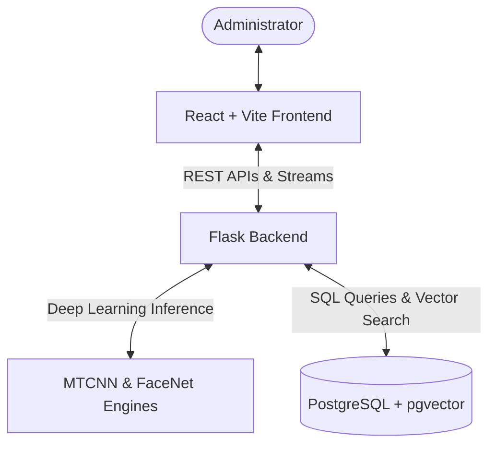

# CCTV-Based Automated Attendance System

A modern, fully automated class attendance monitoring system leveraging real-time computer vision streams (CCTV, IP cameras, webcams) paired with high-performance biometric vector search database matching.

---

## Key Features

- **Live Face Recognition & Logging**: Process stream feeds (via local webcams or RTSP security camera streams) using MTCNN and FaceNet to locate and identify multiple student faces concurrently.
- **Vector Similarity Search**: Utilize PostgreSQL's `pgvector` extension and an HNSW (Hierarchical Navigable Small World) index to match facial embeddings against database records in sub-millisecond speeds.
- **Timetable & Schedule Integration**: Dynamically resolve class attendance rules based on current time schedules and active subject periods.
- **Analytics Dashboard**: Admin visual control panels to monitor live attendance updates, review distribution statistics, inspect weekly attendance rates, and download reports.
- **Enrollment Portal**: Admin module to enroll students, register information parameters, and generate face embeddings directly from photo uploads.

---

## System Architecture

The application is structured into three main layers:



- **Frontend**: Responsive Single-Page Application (SPA) designed in React and Vite.
- **Backend**: Flask server orchestration logic connecting visual processing pipelines to persistent data access.
- **Database**: PostgreSQL with `pgvector` indexing to handle relational academic entities alongside 512-dimension vector features.

---

## Technology Stack

- **Frontend**: React 19, Vite, React Router DOM, Chart.js, Lucide Icons.
- **Backend**: Flask 3.1, SQLAlchemy 2.0 (ORM), psycopg3.
- **Vision Pipeline**: OpenCV, TensorFlow 2.x, MTCNN (face detection), Keras-FaceNet (biometric embedding extraction).
- **Database**: PostgreSQL with `pgvector` extension.

---

## Project Structure

```text
CCTV-based-attendance-system/
├── backend/                   # Flask Server Application
│   ├── api/                   # Blueprint routers for backend endpoints
│   ├── database/              # SQLAlchemy config, models, and CRUD operations
│   ├── services/              # Common orchestration logic
│   ├── vision/                # Computer Vision pipeline (MTCNN, FaceNet, Camera streams)
│   ├── app.py                 # Backend Entry point
│   ├── config.py              # Configuration loading (.env)
│   ├── requirements.txt       # Python package list
│   └── schema.sql             # SQL database script
├── frontend/                  # React & Vite Dashboard Application
│   ├── src/                   # React components, routing, services
│   ├── package.json           # Node packages and scripts
│   └── vite.config.js         # Vite configurations
├── docs/                      # Comprehensive Documentation Guides
│   ├── setup.md               # Detailed system setup instructions
│   ├── workflow.md            # Comprehensive operational diagrams and steps
│   ├── database.md            # Database architecture and schemas
│   └── api.md                 # Backend API routes and payloads
└── .env                       # Environment credentials and configurations
```

---

## Documentation Directory

For complete guides and deep dives, refer to the following documentation files:

- **Setup Guide**: [`docs/setup.md`](file:///c:/Users/kshy/Desktop/CCTV-based-attendace-system/docs/setup.md) — Follow detailed instructions to configure PostgreSQL with `pgvector`, build virtual environments, install system prerequisites, and run the applications.
- **Operational Workflows**: [`docs/workflow.md`](file:///c:/Users/kshy/Desktop/CCTV-based-attendace-system/docs/workflow.md) — View operational flowcharts, sequence diagrams, and mathematical structures behind enrollment and recognition.
- **API Documentation**: [`docs/api.md`](file:///c:/Users/kshy/Desktop/CCTV-based-attendace-system/docs/api.md) — Explore the REST endpoints, expected JSON payloads, and response payloads.

---

## Quick Start Summary

For quick installation (for complete prerequisites, check [`docs/setup.md`](file:///c:/Users/kshy/Desktop/CCTV-based-attendace-system/docs/setup.md)):

### 1. Database Setup

Ensure `pgvector` is installed on PostgreSQL, create a database named `student_details`, and execute the backend schema:

```sql
CREATE DATABASE student_details;
-- Run contents of backend/schema.sql in student_details database
```

### 2. Configuration Setup

Create a `.env` file at the root folder of the project with your PostgreSQL login details:

```env
DATABASE_USERNAME="postgres"
DATABASE_PASSWORD="your_password"
DATABASE_HOST="localhost"
DATABASE_PORT="5432"
DATABASE_NAME="student_details"
```

### 3. Backend Setup

```bash
# In project root folder
python -m venv env
.\env\Scripts\activate          # Windows
pip install -r backend/requirements.txt
cd backend
python app.py
```

### 4. Frontend Setup

```bash
# In another terminal session
cd frontend
npm install
npm run dev
```

Open `http://localhost:5173` in your browser.
