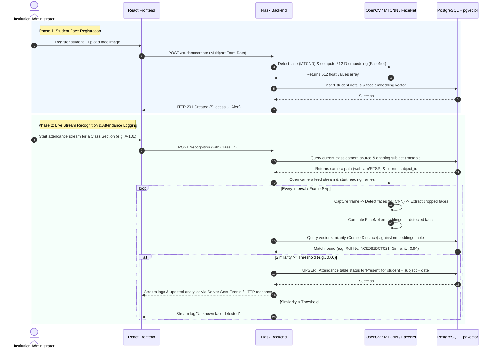
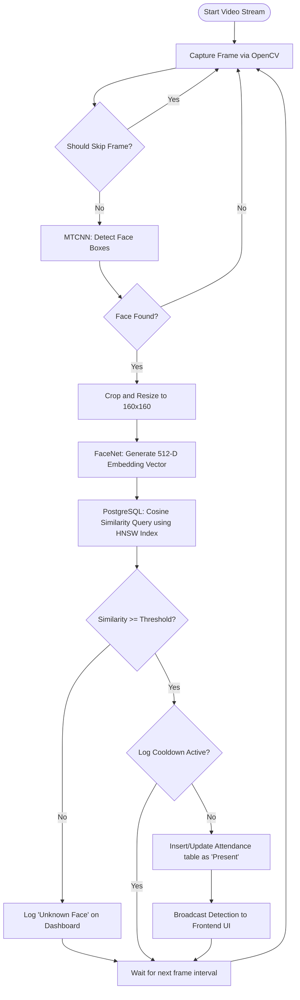

# CCTV-Based Automated Attendance System - Operational Workflow

This document explains the technical and operational workflows of the CCTV-Based Automated Attendance System. It details how the frontend, backend, computer vision pipeline, and PostgreSQL database interact to register students and automate class attendance.

---

## High-Level Architecture Workflow

The system is split into three primary components:

1. **Frontend (React + Vite)**: Administration UI for managing classes, students, timetables, and viewing live recognition streams.
2. **Backend (Flask)**: REST APIs and orchestration logic connecting the vision pipeline to the database.
3. **Database (PostgreSQL + pgvector)**: Stores tabular metadata and high-dimensional face embeddings.



---

## 1. Student Enrollment Workflow (Phase 1)

When adding a student to the system, the facial biometric profile must be generated and stored:

1. **Information Input**: The admin enters academic details (Roll Number, First Name, Last Name, Phone, Address, Class Section) and uploads a clear face portrait photograph.
2. **Face Detection (MTCNN)**:
    - The Flask backend receives the upload.
    - The **MTCNN (Multi-task Cascaded Convolutional Networks)** detector parses the image, locates bounding boxes of faces, and crops the region of interest.
    - If no face is detected or if multiple faces are detected, the backend returns an error.
3. **Feature Extraction (FaceNet)**:
    - The cropped face image is resized to `160x160` pixels and passed through the **FaceNet** deep neural network.
    - FaceNet converts the visual features of the face into a 512-dimension numerical array (floating-point vector) representing coordinates in a face-feature space.
4. **Vector Storage**:
    - The student’s text details are written to the `student` table.
    - The 512-D vector array is inserted into the `embeddings` table (using PostgreSQL's `pgvector` data type) linked to the student's primary key (`rollno`).

---

## 2. Active Session Resolution (Phase 2)

Before starting a camera recognition process, the system must resolve _what_ class and _which_ subject attendance is being recorded for:

1. The admin triggers the recognition page for a selected class (e.g., `A-101`).
2. The backend looks up the class in the database to retrieve its configured `camera_source` (e.g., IP RTSP link `rtsp://...` or physical index `0`).
3. The system queries the `timetable` table using the **current system time** and **current day of the week**:
   $$\text{Current Time} \in [\text{start\_time}, \text{end\_time}] \quad \land \quad \text{day\_of\_week} = \text{Current Day}$$
4. If a matching subject period is found:
    - Attendance logging is initialized for that specific `subject_id`.
    - If no class session is scheduled on the timetable for this hour, the backend records attendance under a default setup or prevents recognition startup, instructing the user to add a timetable slot.

---

## 3. Live Video Face Recognition & Attendance Loop (Phase 3)

Once the camera source is resolved and the stream starts, the core processing loop runs on the backend:



### Detailed Recognition Steps:

1. **Frame Capture**: OpenCV (`cv2.VideoCapture`) connects to the stream and grabs frames continuously.
2. **Frame Skipping (`FRAME_SKIP`)**: To avoid overloading the processor, the system only processes 1 out of every $N$ frames (configured via `FRAME_SKIP` in `.env`). Other frames are discarded.
3. **Embedding Comparison**:
    - The computed vector from the live stream frame is matched against the database using a **Cosine Similarity** query:
      $$\text{Similarity}(A, B) = \frac{A \cdot B}{\|A\| \|B\|}$$
    - This query is accelerated using the PostgreSQL **HNSW (Hierarchical Navigable Small World)** index configured in `schema.sql` on the embeddings table:
        ```sql
        USING hnsw (embedding vector_cosine_ops)
        ```
4. **Attendance Marking**:
    - The student with the closest embedding matching or exceeding the configured `THRESHOLD` (usually `0.60`) is identified.
    - An entry is inserted/updated in the `attendance` table for `(rollno, subject_id, current_date)` with the status set to `'Present'`.
    - **Duplicate prevention**: A database constraint (`unique_attendance`) prevents duplicate rows for the same student, subject, and date.
5. **Cooldown Mechanism**:
    - Once a student is marked present, a local backend timer (`LOG_COOLDOWN_SECONDS`) prevents re-querying the database and flooding the UI with successive recognition events for that same student.
6. **Real-time Reporting**:
    - The backend sends a socket update/SSE chunk to the frontend containing:
        - The detected bounding box coordinates `[x, y, w, h]` (to render face indicators).
        - The student’s name and roll number.
        - Live statistics (Number of faces detected, recognized count, FPS).
